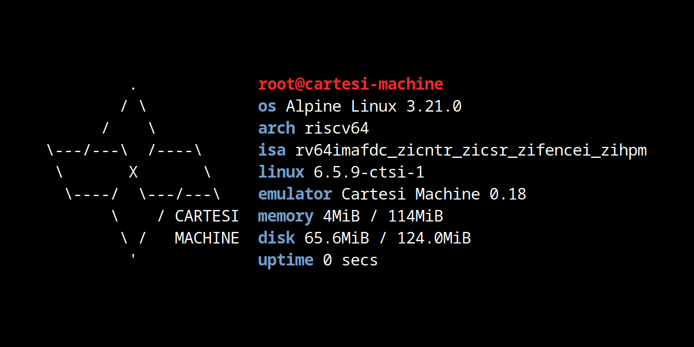

# WebCM

WebCM is a serverless terminal that runs a virtual Linux
directly in the browser by emulating a RISC-V machine.

It's powered by the [Cartesi Machine emulator](https://github.com/cartesi/machine-emulator), which enables deterministic,
verifiable and sandboxed execution of RV64GC Linux applications.

It's packaged as a single 24MiB WebAssembly file containing
the emulator, the kernel and Alpine Linux operating system.

Try it now by clicking on the image above.

## How it works?

The Cartesi Machine emulator library was compiled to WASM using Emscripten toolchain.
Then a simple C program instantiates a new Linux machine and boots in interactive terminak.

To have a terminal in the browser the following projects were used:

- https://github.com/mame/xterm-pty
- https://xtermjs.org
