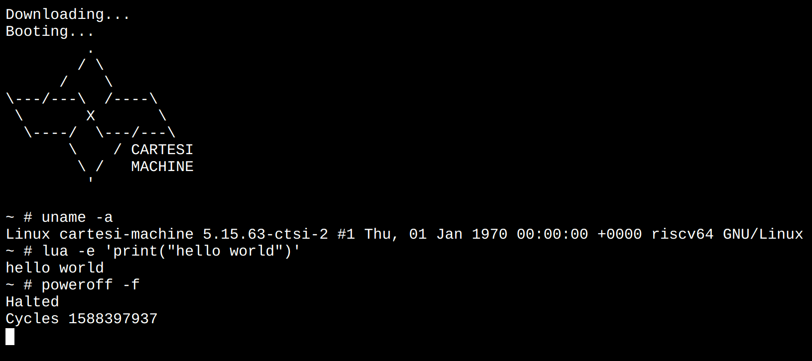

# WebCM

Cartesi Machine booting a full interactive Linux OS with RISC-V architecture in the browser:

https://cartesi-machine.surge.sh/

This is using [Cartesi Machine Emulator](https://github.com/cartesi/machine-emulator) compiled to WebAssembly.

It boots the [Cartesi Machine SDK](https://github.com/cartesi/machine-emulator-sdk) original kernel and rootfs images.

## Cool commands to try

Some interesting commands to try:
- `python -c "print('hello')"` - Run Python code.
- `lua -e "print('hello')"` - Run Lua code.
- `bc` - Use a calculator.
- `python` or `lua` - Code in Python or Lua interactively, can also be used as a calculator.
- `vi test.py && python test.py` - Code a Python program using `vi` text editor and then run it.
- `sl` - View animation of a train :steam_locomotive: .
- `echo hello | sha256sum` - Compute sha256 hash of a word.
- `time dhrystone 500000` - Run integer benchmark.
- `time whetstone 5000` - Run floating-point benchmark.
- `hdparm -t /dev/mtdblock0` - Run disk read benchmark.
- `uname -a` - Check the Linux kernel and architecture information.
- `dmesg` - Check Linux boot logs.
- `ps` - Check running processes.
- `top` - Check running processes in real-time.
- `mount` - Check mounted filesystems.
- `free -h` - Check system memory.
- `df -h` - Check system disk usage.
- `id` - Check running user.
- `ls -la /` - Check the filesystem root directories.
- `ascii` - View the ASCII table.
- `cat /etc/issue /etc/os-release` - View Cartesi's rootfs release.
- `ping -c 3 localhost; ifconfig` -- Test internal networking.
- `sqlite3 test.db -json "CREATE TABLE users(name text, age int); INSERT INTO users VALUES('John',42); SELECT * FROM users" | jq` - Create a SQLite3 database and dump it as pretty JSON.
- `history` - View history of commands executed so far.
- `poweroff -f` - Halt the machine and view how many cycles were executed in total.

## How it works?

The Cartesi Machine emulator library was compiled to WASM using Emscripten toolchain.
Then a simple C program instantiates a new Linux machine and boots in interactive shell mode.

To have a terminal in the browser the following projects were used:

- https://github.com/mame/xterm-pty
- https://xtermjs.org
